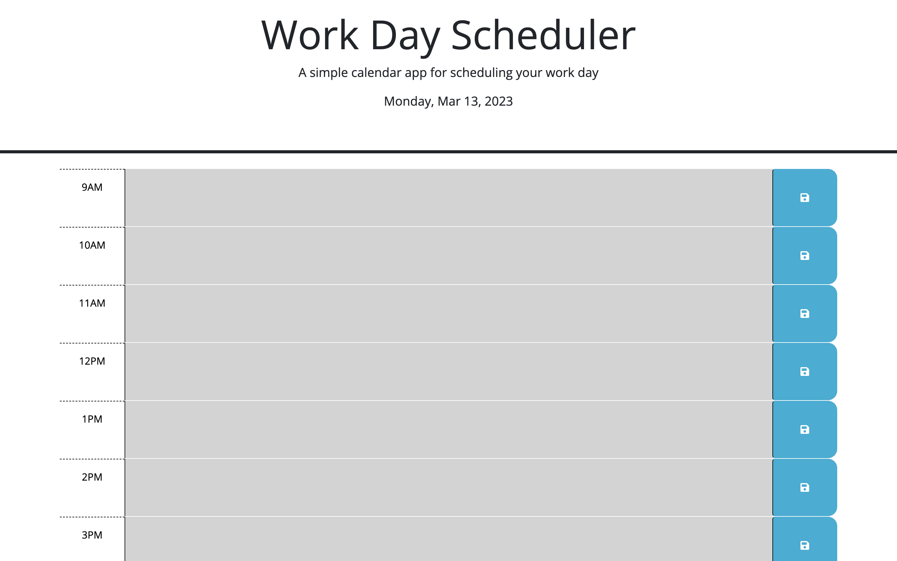
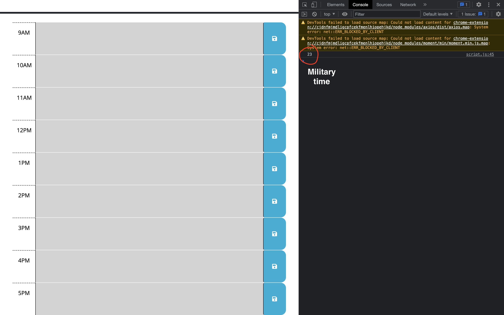
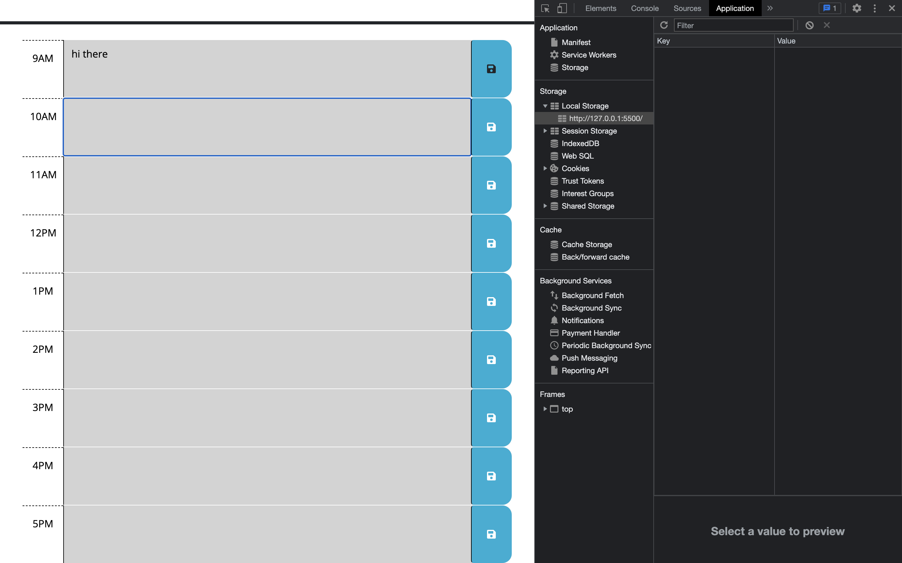
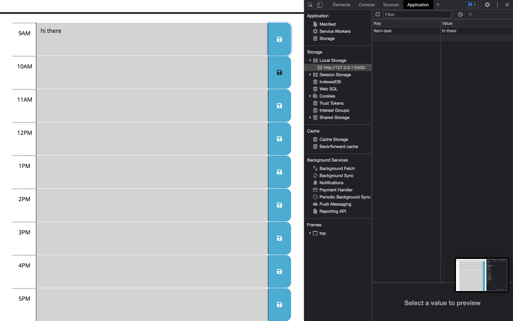
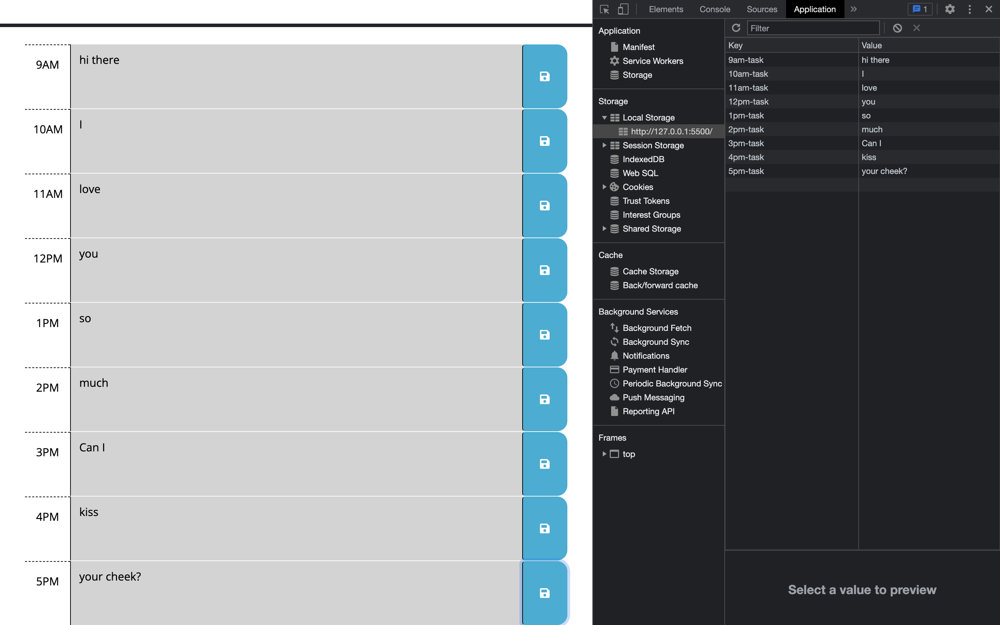
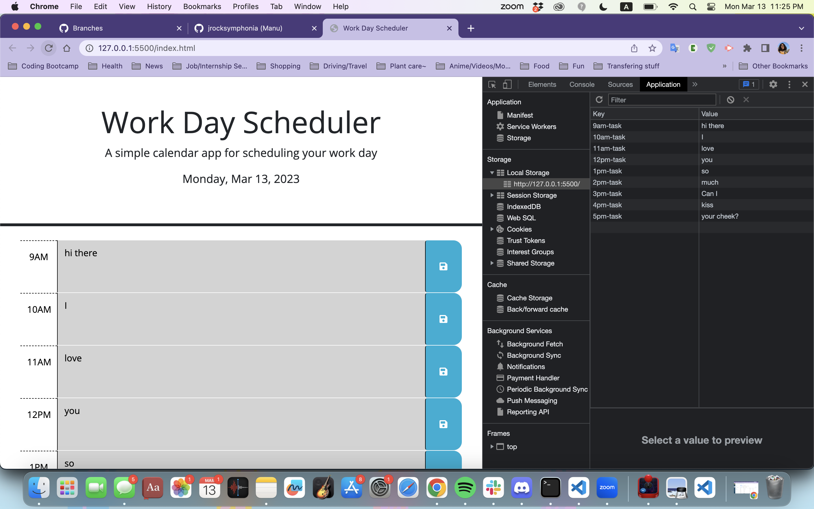

# c5_work-day-scheduler
A simple calendar application that allows a user to save events for each hour of the day

## Description
This project is intended to help employees plan their work day efficiently using an online planner that logs all the things they plan to do for the day. If they have a reoccuring thing they want to do each day, the site will remember the inputs and save it to local storage. That way if they ever refresh or exit out of the tab, the inputs are saved into the site's local storage and will repopulate the page when you open the page back up again. It also has a built-in past-present future hour marker so you can keep track of the time.

## Installation

N/A

## Usage

**remember to refresh the page to see the updated hour!

Link to the live page here: https://jrocksymphonia.github.io/c5_work-day-scheduler/

## Credits
Links of reference:

.each()
https://api.jquery.com/each/

storage.setItem()
https://developer.mozilla.org/en-US/docs/Web/API/Storage/setItem

document.ready()
https://learn.jquery.com/using-jquery-core/document-ready/

## License
Please refer to the LICENSE in the repo.

---